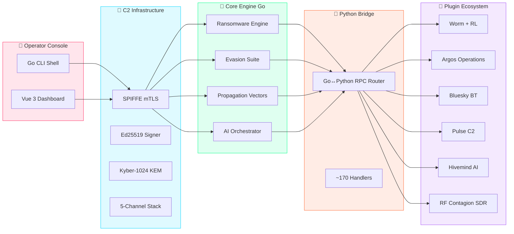

<p align="center">
  
</p>

<p align="center">
  
</p>

<br/>

<p align="center">
  <a href="#-what-is-x404x"></a>
  <a href="#-architecture"></a>
  <a href="#-modules"></a>
  <a href="#-quick-start"></a>
</p>

<br/>

---

<br/>

<p align="center">
  
  
  
  
  
</p>

<p align="center">
  <a href="https://github.com/Ruby570bocadito/X404X/stargazers"></a>
  <a href="https://github.com/Ruby570bocadito/X404X/network"></a>
</p>

<br/>

<table align="center">
<tr>
<td align="center" width="25%">
  <h3>🛡️ KERNEL<br/>EVASION</h3>
  <sub>BYOVD · DKOM · Blue Pill</sub>
</td>
<td align="center" width="25%">
  <h3>🔐 POST-QUANTUM<br/>C2</h3>
  <sub>Kyber-1024 · Ed25519 · SPIFFE</sub>
</td>
<td align="center" width="25%">
  <h3>🦠 EXOTIC<br/>PROPAGATION</h3>
  <sub>Ultrasound · PLC · QR · PJL</sub>
</td>
<td align="center" width="25%">
  <h3>🧠 AI<br/>ORCHESTRATOR</h3>
  <sub>Q-Learning · FedAvg · Deepfake</sub>
</td>
</tr>
</table>

<br/>

## What is X404X?

> **X404X** is an **autonomous red team operations suite** that covers the complete offensive kill chain. From kernel-level evasion to post-quantum command & control — every module is implemented in real code, not simulated stubs.

Built as a **Go** core with a **Python** bridge layer and **WASM** extension support, X404X integrates 45 offensive modules across 4 development phases — all compiled, tested, and ready for authorized red team engagements.

---

## Architecture

<br/>



<br/>

---

## Kill Chain Coverage

<br/>

```
  ╔══════════════════════════════════════════════════════════════════════╗
  ║                        ATTACK KILL CHAIN                           ║
  ╠═══════╦══════════╦══════════╦══════════╦══════════╦════════════════╣
  ║ RECON ║ INITIAL  ║  EXEC    ║ PERSIST  ║ PRIVESC  ║   LATERAL     ║
  ║       ║ ACCESS   ║          ║          ║          ║                ║
  ╠═══════╬══════════╬══════════╬══════════╬══════════╬════════════════╣
  ║ OSINT ║ Phish AI ║ LOLBin   ║ WER      ║ BYOVD    ║ Kerberos      ║
  ║ Recon ║ CI/CD    ║ Chainer  ║ Triple   ║ DKOM     ║ Delegation    ║
  ║ DNS   ║ QR Worm  ║ Reflect  ║ MFT      ║ Token    ║ IMDSv2 (AWS)  ║
  ║ APIs  ║ USB ADB  ║ DLL      ║ Slack    ║ Steal    ║ VLAN Jump     ║
  ║       ║ PJL      ║ WASM     ║ Schtasks ║          ║ Chronos NTP   ║
  ╚═══════╩══════════╩══════════╩══════════╩══════════╩════════════════╝
                  │                          │
  ╔═══════════════╩══════════╦═══════════════╩═════════════╗
  ║          EVASION         ║         C2 & EXFIL          ║
  ╠══════════════════════════╬═════════════════════════════╣
  ║ WFP DNS Poisoning        ║ SPIFFE mTLS + Ed25519      ║
  ║ Blue Pill Hypervisor     ║ Kyber-1024 Post-Quantum    ║
  ║ Anti-Reversing Suite     ║ 5-Channel Stack            ║
  ║ Anti-Forensics (DoD 7p)  ║ Blockchain C2 (BTC/ETH)    ║
  ║ MFT Slack Hide           ║ MFT Slack Storage          ║
  ╚══════════════════════════╩═════════════════════════════╝
```

<br/>

---

## Phase Completion

<br/>

```
FASE 0  ████████████████████████  100%  Critical Stubs Fixed
FASE 1  ████████████████████████  100%  Evasion + Anti-Forensics
FASE 2  ████████████████████████  100%  C2 Hardened
FASE 3  ████████████████████████  100%  Advanced Propagation
FASE 4  ████████████████████████  100%  AI + Cross-Platform
        └──────────────────────┘
        45 Modules · 12,685 Lines
```

<br/>

| Phase | Theme | 🧩 | 📝 Lines | Status |
|:-----:|-------|:--:|---------|:------:|
| **0** | Critical Stubs | 8 | 500 | `█████████░` 100% |
| **1** | Evasion + Anti-Forensics | 10 | 3,599 | `█████████░` 100% |
| **2** | C2 Hardened | 6 | 2,374 | `█████████░` 100% |
| **3** | Advanced Propagation | 12 | 3,274 | `█████████░` 100% |
| **4** | AI + Cross-Platform | 9 | 2,938 | `█████████░` 100% |

<br/>

---

## Module Matrix

<br/>

### 🔴 FASE 1 — Evasion & Anti-Forensics

| # | Module | Capability | OS |
|:--:|--------|------------|:--:|
| 1.1 | **BYOVD Loader** | 5 vulnerable drivers (WinRing0, Gdrv, RTCore64, kprocesshacker, CPUID) · IOCTLs · R/W physical memory · MSR · handle elevation |  |
| 1.2 | **DKOM** | Process hiding via ActiveProcessLinks unlink · SYSTEM token steal · EPROCESS offsets per build |  |
| 1.3 | **Anti-Reversing** | HW BP detect (DR0-DR7) · INT3 scan · CRC32 integrity · RDTSC timing · sandbox + virtual MAC check |  |
| 1.4 | **Anti-Forensics** | DoD 5220.22-M 7-pass wipe · MFT $BITMAP corruption · VAD hide · crash dump/event log/prefetch/USN/Shellbag wipe |  |
| 1.5 | **WER Persistence** | Windows Error Reporting Hangs hijack · Silent Process Exit · startup + Run key + schtasks |  |
| 1.6 | **MFT Slack** | NTFS slack space R/W via PowerShell · AES-GCM encrypted fragments · hidden agent/ransom note storage |  |
| 1.7 | **WFP DNS Poison** | WFP provider + netsh fallback · fake DNS server (UDP 53) · hosts file injection · cache flush |  |
| 1.8 | **Blue Pill HV** | VMXON/VMCS VT-x hypervisor · PatchGuard bypass · CPUID trap · memory hiding |  |
| 1.9 | **LOLBin Chainer** | 28 LOLBins (20 Win + 8 Linux) · randomized chain per hour · multi-layer base64 encoding |  |
| 1.10 | **Kernel DNS Driver** | NDIS filter driver · blocks Defender/Security updates · DNS redirect to C2 |  |

### 🔵 FASE 2 — C2 Hardened

| # | Module | Capability | OS |
|:--:|--------|------------|:--:|
| 2.1 | **SPIFFE mTLS** | SVID generation · trust bundle · peer SPIFFE ID verification · certificate rotation · mTLS server/client |  |
| 2.2 | **Multi-Channel C2** | 5 channels (gRPC→WebSocket→DoH→Twitter→Blockchain) · health check · auto-failover · beacon loop |  |
| 2.3 | **Ed25519 Signing** | Command sign/verify · nonce replay protection · trusted key ring · batch operations |  |
| 2.4 | **Dashboard Ops** | HTTP+WebSocket API · agent nodes · propagation map · signed command issuance · embedded HTML |  |
| 2.5 | **Kyber-1024** | Hybrid KEM (ML-KEM-1024 + X25519) · HKDF derivation · AES-256-GCM + HMAC-SHA256 sessions |  |
| 2.6 | **Proto Obfuscation** | XOR+AES-CTR+GZIP · integrity verification · vaporize buffers · memory-only loading |  |

### 🟢 FASE 3 — Advanced Propagation

| # | Module | Capability | OS |
|:--:|--------|------------|:--:|
| 3.1 | **Ultrasound QPSK** | >18kHz modulation · WAV generation · speaker/mic RX/TX · preamble sync |  |
| 3.2 | **Powerline PLC** | HomePlug device scan · UPnP SSDP · SOAP injection over electrical grid |  |
| 3.3 | **USB ADB** | ADB enumeration · APK install · remote shell exec · SMS/contacts dump |  |
| 3.4 | **DNS Rebinding** | TTL=0 rebind server · SOP bypass JS payload · SSRF lateral via Host headers |  |
| 3.5 | **CI/CD Webhooks** | GitHub Actions · Jenkins · GitLab CI injection · 10 CI scanner |  |
| 3.6 | **VLAN Jump** | Double tagging · DTP negotiation · ARP flood · DHCP per VLAN |  |
| 3.7 | **QR Dynamic Worm** | QR matrix generation · PNG rendering · rotation channel |  |
| 3.8 | **PJL Printer Worm** | Printer job language exploits · NVRAM R/W · firmware infection · PCL ransom note |  |
| 3.9 | **Chronos NTP** | Fake NTP server · time forward/rewind · schtask shift · w32tm hijack |  |
| 3.10 | **Reflective DLL** | NtCreateSection+NtMapViewOfSection · 100-byte NASM stager · remote thread injection |  |
| 3.11 | **Kerberos Deleg** | Unconstrained delegation discovery · coercion · TGT dump · Silver Ticket |  |
| 3.12 | **IMDSv2 Bypass** | AWS token acquisition · IAM extraction · SSRF · AssumeRole · neighbor scan |  |

### 🟣 FASE 4 — AI + Cross-Platform

| # | Module | Capability | OS |
|:--:|--------|------------|:--:|
| 4.1 | **Cross-Platform Loader** | ELF · Mach-O · APK generation · pack+encrypt · syscall hooks |  |
| 4.2 | **JIT Polymorphism** | NOP-sleds · code crossover · register reordering · runtime mutation loop |  |
| 4.3 | **AI FSM Orchestrator** | Q-learning state machine · exploration vs exploitation · risk prediction |  |
| 4.4 | **Federated Learning** | FedAvg aggregation · victim profiling · phishing time prediction · model export |  |
| 4.5 | **Autofactory Fuzzer** | AFL++ integration · 9 mutation strategies · crash detection · exploit candidates |  |
| 4.6 | **Wazero Bridge** | WASM module parsing · TinyGo compilation · Python→WASM migration |  |
| 4.7 | **RF Contagion** | SDR detection (RTL-SDR/HackRF) · ModemManager · baseband injection · IMSI · SS7 |  |
| 4.8 | **EDR Test Lab** | Docker Compose · Windows Server 2022 · ELK Stack · Sysmon · automated tests |  |
| 4.9 | **Deepfake Vishing** | Coqui TTS (tacotron2-DDC) · VoIP · SMS phishing · SE profiling |  |

<br/>

---

## 🚀 Quick Start

<br/>

### Prerequisites

```bash
# Required
go >= 1.22        # Core engine (Go)
python >= 3.11    # Bridge + handlers (Python)
git               # Version control

# Optional
docker >= 27.0    # EDR lab + containerized deployment
node >= 22.0      # Dashboard frontend (Vue 3)
```

### One-Click Deploy

```bash
# Full stack deployment (Linux/macOS)
bash deploy/deploy.sh

# This will:
#  1. Install Go & Python dependencies
#  2. Build the C2 server
#  3. Start the Python bridge
#  4. Launch the dashboard on port 9090
#  5. Start the worm engine in dry-run mode
```

### Manual Setup

```bash
# 1. Clone & enter
git clone https://github.com/Ruby570bocadito/X404X.git
cd X404X

# 2. Install dependencies
pip install -r requirements.txt
cd internal/ransomware && go mod tidy && cd ../..

# 3. Start the Python Bridge
cd modules/bridge && python3 bridge.py &
cd ../..

# 4. Build & launch C2 Dashboard
cd plugins/pulse-c2/src/go
go build -o x404x-dashboard ./cmd/dashboard
./x404x-dashboard -port 9090 &
cd ../../..
# → Open http://localhost:9090

# 5. Launch interactive console
cd cmd/x404x
go run . console
# → Type 'help' for available commands
```

### Run Modes

```bash
# ─── Dry-Run Demo (safe — no real exploits) ─────────────
bash scripts/run_demo.sh

# ─── Worm Simulation ────────────────────────────────────
cd plugins/worm
# Windows
python worm_core.py --config configs/config_simulation.yaml
# Linux/macOS
python3 worm_core.py --config configs/config_simulation.yaml

# ─── Live Campaign (⚠️ authorized targets only) ──────────
cd cmd/x404x
go run . campaign start --name "Operation Nightfall" --targets targets.json

# ─── EDR Test Lab ────────────────────────────────────────
docker-compose -f lab/docker-compose.edr.yml up -d
# → Windows Server 2022 + Defender ATP + ELK + Sysmon
# → Automated evasion test suite runs on boot
```

### Console Commands

```bash
# Inside the X404X interactive console:
help              # List all commands
modules           # Show available modules (45 total)
campaign start    # Start a new campaign (FSM-driven)
recon             # Run reconnaissance module
exploit           # Execute exploit chain
privesc           # Privilege escalation
persist           # Install persistence mechanisms
lateral           # Lateral movement
exfil             # Data exfiltration
dashboard         # Open dashboard URL
deploy            # One-click full deploy
status            # Show campaign status
killchain         # Display kill chain progress
ransomware        # Launch ransomware engine
propagate         # Start worm propagation
listeners         # List active C2 listeners
webhook           # Configure webhook notifications
```

<br/>

---

## Directory Map

<br/>

```
X404X/
│
├── cmd/                           ← CLI + Implant Agent
│   ├── x404x/console.go           Interactive shell
│   └── implant/main.go            Go C2 agent
│
├── internal/                      ← CORE ENGINE
│   ├── ransomware/                Engine principal (37 files)
│   │   ├── hydra_vectors/         8 vectores exóticos
│   │   ├── loader/cross.go        ELF · Mach-O · APK
│   │   ├── stager/reflective_asm  Reflective DLL NASM
│   │   ├── v27/ v29/ v210/        Versiones avanzadas
│   │   └── *.go                   Módulos core
│   ├── agent/                     Post-exploit + privesc
│   ├── appstate/                  FSM + AI orchestrator
│   ├── bridge/wazero_loader.go    WASM bridge
│   └── dispatch/dispatcher.go     MITRE ATT&CK mapper
│
├── modules/bridge/                ← PYTHON BRIDGE
│   ├── bridge.py                  Go↔Python RPC router
│   └── handlers/                  12 files · ~170 handlers
│
├── plugins/                       ← PLUGIN ECOSYSTEM
│   ├── worm/                      35 exploits + RL engine
│   ├── operations/                Argos agents + UI
│   ├── pulse-c2/                  Crypto + Dashboard
│   ├── ai/                        Hivemind · Fuzzer · Vishing
│   ├── blue/bluesky/              Bluetooth attacks
│   └── rf_contagion/              SDR 4G/5G baseband
│
├── lab/docker-compose.edr.yml     EDR test environment
├── deployments/deploy.sh          One-click deploy
├── scripts/run_demo.sh            Cross-platform demo
├── ROADMAP.md                     Development roadmap
└── requirements.txt               Dependencies
```

<br/>

---

## Tech Canvas

<p align="center">
  <table>
    <tr>
      <td align="center"><b>LANGUAGE</b></td>
      <td align="center"><b>FRAMEWORK</b></td>
      <td align="center"><b>CRYPTO</b></td>
      <td align="center"><b>TOOL</b></td>
    </tr>
    <tr>
      <td align="center"></td>
      <td align="center"></td>
      <td align="center"></td>
      <td align="center"></td>
    </tr>
    <tr>
      <td align="center"></td>
      <td align="center"></td>
      <td align="center"></td>
      <td align="center"></td>
    </tr>
    <tr>
      <td align="center"></td>
      <td align="center"></td>
      <td align="center"></td>
      <td align="center"></td>
    </tr>
    <tr>
      <td align="center"></td>
      <td align="center"></td>
      <td align="center"></td>
      <td align="center"></td>
    </tr>
  </table>
</p>

<br/>

---

## Stats

<p align="center">
  
  
  
  
  
  
</p>

<br/>

---

## Legal

> **⚠️ DISCLAIMER:** This project exists exclusively for **educational purposes, authorized security research, and red team operations with explicit written consent**. Unauthorized use against systems you do not own or have permission to test is **illegal** and **strictly prohibited**. The authors and contributors assume **zero liability** for any misuse, damage, or legal consequences resulting from improper use of this codebase.
>
> **By using this software, you acknowledge that you are solely responsible for complying with all applicable laws and regulations.**

<br/>

<p align="center">
  <sub>
    <a href="https://github.com/Ruby570bocadito">RBYHACK</a> © 2025-2026 ·
    Built in Málaga, Spain ·
    <a href="https://github.com/Ruby570bocadito/X404X/blob/main/ROADMAP.md">Roadmap</a> ·
    <a href="https://github.com/Ruby570bocadito/X404X/issues">Report Issue</a>
  </sub>
</p>

<br/>
